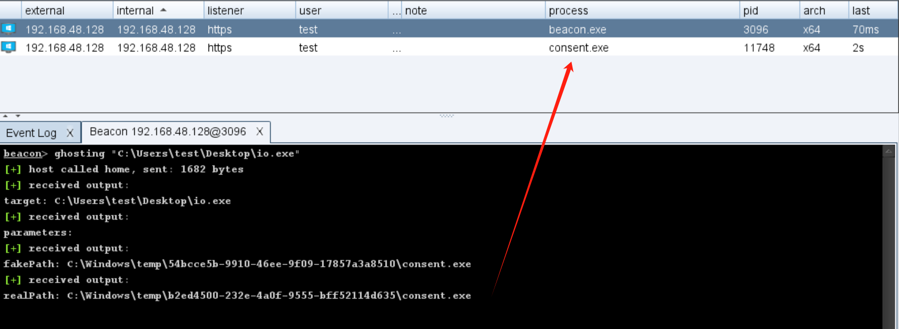
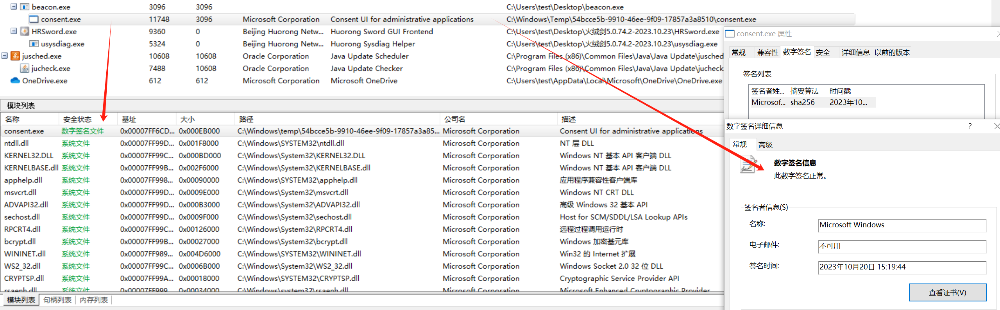
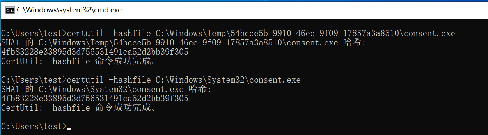

# Ghosting BOF

主要用于隐藏进程真实路径，进程带windows真签名

加载cna后，用gosting "path" "parameters" 运行你想要的程序：

使用火绒剑查看相关进程信息：

进程对应文件hash一致：

自行套用bof-vs进行编译，MinGW版等空了再加上去(https://github.com/Cobalt-Strike/bof-vs)

关注我：

